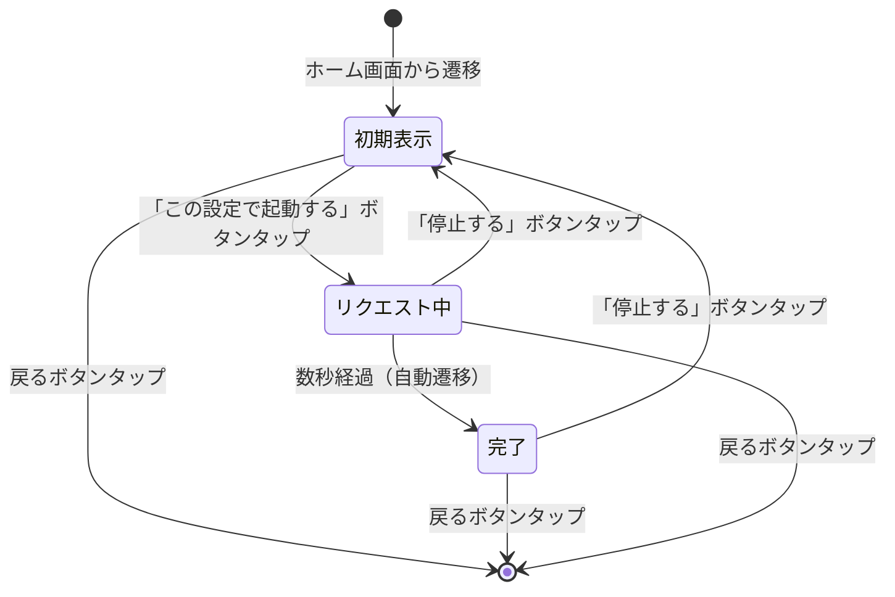

# エアコン画面仕様書

## 概要

エアコン画面は、車両のエアコンをリモート操作するための画面です。ホーム画面のエアコンボタンからプッシュ遷移で表示されます。

## 状態遷移図



## 状態管理

### ViewModel State Enum

```kotlin
enum class AirConditionerState {
    INITIAL_DISPLAY,    // 初期表示
    REQUESTING,         // リクエスト中
    COMPLETED           // 完了
}
```

## 画面仕様

### 共通仕様

#### テーマ・カラーパレット
- **背景色**: ダークテーマ（`#1A001A` - 濃い紫黒）
- **テキスト色**: 白色（`#FFFFFF`）
- **アクセント色**: 赤色（`#E53935`）
- **セパレーター色**: 薄いグレー（`#333333`）
- **通知設定セクション背景**: やや明るいダークグレー（`#28283D`）

#### レイアウト構造
- **Safe Area/WindowInsets**: システムUI（ステータスバー、ノッチ、ホームインジケータ）を避けて配置
- **水平パディング**: 16-24dp/pt
- **垂直パディング**: 24-32dp/pt
- **フォント**: システムデフォルトサンセリフ

#### ナビゲーションバー
- **高さ**: 56-64dp（Android）、44-56pt（iOS）
- **背景色**: メイン画面背景色と同じ
- **左側**: 戻るボタン（左向き矢印アイコン）
- **中央**: タイトル「エアコン」
- **右側**: ヘルプボタン（疑問符アイコン）

---

## 1. 初期表示状態（エアコン画面_初期表示）

### レイアウト構造

```
┌─────────────────────────────────┐
│ ナビゲーションバー                │
├─────────────────────────────────┤
│ 確認メッセージ                   │
│                                 │
│ 設定セクションヘッダー            │
│ ┌─────────────────────────────┐ │
│ │ エアコンの設定    変更する    │ │
│ └─────────────────────────────┘ │
│                                 │
│ 設定表示セクション                │
│ ┌─────────────────────────────┐ │
│ │ ─────────────────────────── │ │
│ │ 起動時間                    │ │
│ │                             │ │
│ │        10分間               │ │
│ │                             │ │
│ │ ─────────────────────────── │ │
│ └─────────────────────────────┘ │
│                                 │
│ プライマリアクションボタン        │
│ ┌─────────────────────────────┐ │
│ │    この設定で起動する        │ │
│ └─────────────────────────────┘ │
└─────────────────────────────────┘
```

### UI要素詳細

#### 確認メッセージ
- **テキスト**: "下記の設定でエアコンを起動します。よろしいですか?"
- **フォントサイズ**: 14-16sp/pt
- **フォントウェイト**: Regular
- **色**: 白色
- **配置**: 左寄せ
- **垂直マージン**: ナビゲーションバーから24-32dp/pt

#### 設定セクションヘッダー
- **レイアウト**: 水平配置
- **左側（タイトル）**:
  - テキスト: "エアコンの設定"
  - フォントサイズ: 16-18sp/pt
  - フォントウェイト: Semi-bold
  - 色: 白色
- **右側（変更リンク）**:
  - テキスト: "変更する"
  - フォントサイズ: 14-16sp/pt
  - フォントウェイト: Regular
  - 色: 赤色（`#E53935`）
  - インタラクション: タップ可能

#### 設定表示セクション
- **背景**: 透明
- **境界線**: 上下に薄いグレーのセパレーター線（1dp/pt）
- **内容**:
  - **ラベル**: "起動時間"
    - フォントサイズ: 14-16sp/pt
    - フォントウェイト: Regular
    - 色: 白色
    - 配置: 左寄せ
  - **値表示**: "10分間"
    - 数字「10」: 48-60sp/pt、Light/Regular
    - 単位「分間」: 14-16sp/pt、Regular
    - 色: 白色
    - 配置: 水平中央

#### プライマリアクションボタン
- **テキスト**: "この設定で起動する"
- **背景色**: 赤色（`#E53935`）
- **テキスト色**: 白色
- **フォントサイズ**: 16-18sp/pt
- **フォントウェイト**: Semi-bold
- **形状**: 角丸矩形（角半径8-12dp/pt）
- **高さ**: 48-56dp/pt
- **幅**: 画面幅の80-90%
- **配置**: 水平中央
- **垂直マージン**: 設定表示から40-60dp/pt

### ユーザーインタラクション
- **「変更する」リンク**: 設定変更画面への遷移
- **「この設定で起動する」ボタン**: リクエスト中状態への遷移
- **戻るボタン**: 前の画面（ホーム画面）への遷移

---

## 2. リクエスト中状態（エアコン画面_リクエスト中）

### レイアウト構造

```
┌─────────────────────────────────┐
│ ナビゲーションバー                │
├─────────────────────────────────┤
│ リクエストステータス              │
│ ┌─────────────────────────────┐ │
│ │        リクエスト中          │ │
│ │                             │ │
│ │        [ローディング]        │ │
│ └─────────────────────────────┘ │
│ ─────────────────────────────── │
│ 操作詳細                        │
│ ┌─────────────────────────────┐ │
│ │    この設定で動作中          │ │
│ │                             │ │
│ │        起動時間              │ │
│ │                             │ │
│ │          --                 │ │
│ └─────────────────────────────┘ │
│ ─────────────────────────────── │
│ 停止ボタン                      │
│ ┌─────────────────────────────┐ │
│ │          停止する            │ │
│ └─────────────────────────────┘ │
│                                 │
│ 通知設定セクション                │
│ ┌─────────────────────────────┐ │
│ │ 通知設定                    │ │
│ │ クルマの操作関連通知を...    │ │
│ │ ★ アプリの通知を設定する     │ │
│ └─────────────────────────────┘ │
└─────────────────────────────────┘
```

### UI要素詳細

#### リクエストステータス
- **テキスト**: "リクエスト中"
- **フォントサイズ**: 16-18sp/pt
- **フォントウェイト**: Regular
- **色**: 白色
- **配置**: 水平中央
- **ローディングインジケーター**:
  - 形状: 円形スピナー
  - サイズ: 48x48dp/pt
  - 色: 赤オレンジ色（`#FF4500`）
  - アニメーション: 連続回転

#### 操作詳細セクション
- **境界線**: 上下に薄いグレーのセパレーター線
- **内容**:
  - **ステータステキスト**: "この設定で動作中"
    - フォントサイズ: 16-18sp/pt
    - フォントウェイト: Regular
    - 色: 白色
    - 配置: 水平中央
  - **ラベル**: "起動時間"
    - フォントサイズ: 14-16sp/pt
    - フォントウェイト: Regular
    - 色: 薄いグレー（`#CCCCCC`）
    - 配置: 水平中央
  - **値表示**: "--"
    - フォントサイズ: 20-24sp/pt
    - フォントウェイト: Medium
    - 色: 白色
    - 配置: 水平中央

#### 停止ボタン
- **テキスト**: "停止する"
- **背景色**: ダークグレー（`#33334A`）
- **テキスト色**: 白色
- **フォントサイズ**: 16-18sp/pt
- **フォントウェイト**: Medium
- **形状**: 角丸矩形
- **高さ**: 48-56dp/pt
- **幅**: 画面幅の80-90%
- **配置**: 水平中央

#### 通知設定セクション
- **背景色**: やや明るいダークグレー（`#28283D`）
- **形状**: 角丸矩形（角半径10-16dp/pt）
- **内部パディング**: 16-20dp/pt
- **内容**:
  - **セクションタイトル**: "通知設定"
    - フォントサイズ: 18-20sp/pt
    - フォントウェイト: Medium
    - 色: 白色
  - **説明テキスト**: "クルマの操作関連通知をONにすると、リモート操作完了時にお知らせします。"
    - フォントサイズ: 14-16sp/pt
    - フォントウェイト: Regular
    - 色: 薄いグレー（`#CCCCCC`）
  - **設定ボタン**: "★ アプリの通知を設定する"
    - アイコン: ギアアイコン
    - フォントサイズ: 16-18sp/pt
    - フォントウェイト: Regular
    - 色: 白色

### ユーザーインタラクション
- **「停止する」ボタン**: 初期表示状態への遷移
- **「アプリの通知を設定する」**: 通知設定画面への遷移
- **戻るボタン**: 前の画面への遷移

### アニメーション
- **ローディングインジケーター**: 連続回転アニメーション
- **状態遷移**: 数秒後に自動的に完了状態へ遷移

---

## 3. 完了状態（エアコン画面_完了）

### レイアウト構造

```
┌─────────────────────────────────┐
│ ナビゲーションバー                │
├─────────────────────────────────┤
│ エアコン停止タイマー              │
│ ┌─────────────────────────────┐ │
│ │      エアコン停止まで        │ │
│ │                             │ │
│ │          9分                │ │
│ └─────────────────────────────┘ │
│                                 │
│ 操作詳細                        │
│ ┌─────────────────────────────┐ │
│ │    この設定で動作中          │ │
│ │                             │ │
│ │        起動時間              │ │
│ │                             │ │
│ │        10分間               │ │
│ └─────────────────────────────┘ │
│                                 │
│ 停止ボタン                      │
│ ┌─────────────────────────────┐ │
│ │          停止する            │ │
│ └─────────────────────────────┘ │
│                                 │
│ 通知設定セクション                │
│ ┌─────────────────────────────┐ │
│ │ 通知設定                    │ │
│ │ クルマの操作関連通知を...    │ │
│ │ ★ アプリの通知を設定する     │ │
│ └─────────────────────────────┘ │
└─────────────────────────────────┘
```

### UI要素詳細

#### エアコン停止タイマー
- **ラベル**: "エアコン停止まで"
  - フォントサイズ: 14-16sp/pt
  - フォントウェイト: Regular
  - 色: 白色
  - 配置: 水平中央
- **値表示**: "9分"
  - 数字「9」: 48-60sp/pt、Bold/Heavy
  - 単位「分」: 18-20sp/pt、Regular
  - 色: 白色
  - 配置: 水平中央

#### 操作詳細セクション
- **ステータステキスト**: "この設定で動作中"
  - フォントサイズ: 14-16sp/pt
  - フォントウェイト: Regular
  - 色: 白色
  - 配置: 水平中央
- **ラベル**: "起動時間"
  - フォントサイズ: 14-16sp/pt
  - フォントウェイト: Regular
  - 色: 白色
  - 配置: 水平中央
- **値表示**: "10分間"
  - 数字「10」: 28-32sp/pt、Medium/Semi-bold
  - 単位「分間」: 14-16sp/pt、Regular
  - 色: 白色
  - 配置: 水平中央

#### 停止ボタン
- **テキスト**: "停止する"
- **背景色**: 赤色（`#FF3B30`）
- **テキスト色**: 白色
- **フォントサイズ**: 16-18sp/pt
- **フォントウェイト**: Medium/Semi-bold
- **形状**: 角丸矩形（角半径8-12dp/pt）
- **高さ**: 48-56dp/pt
- **幅**: 画面幅の80-90%
- **配置**: 水平中央

#### 通知設定セクション
- リクエスト中状態と同じ仕様

### ユーザーインタラクション
- **「停止する」ボタン**: 初期表示状態への遷移
- **「アプリの通知を設定する」**: 通知設定画面への遷移
- **戻るボタン**: 前の画面への遷移

---

## 状態遷移・アニメーション仕様

### 遷移タイミング
1. **初期表示 → リクエスト中**: ユーザーが「この設定で起動する」ボタンをタップした瞬間
2. **リクエスト中 → 完了**: リクエスト中状態表示から3-5秒後（自動遷移）
3. **完了 → 初期表示**: ユーザーが「停止する」ボタンをタップした瞬間
4. **リクエスト中 → 初期表示**: ユーザーが「停止する」ボタンをタップした瞬間

### アニメーション
- **画面遷移**: スライドアニメーション（プッシュ遷移）
- **ローディングインジケーター**: 連続回転アニメーション（リクエスト中状態のみ）
- **ボタンタップ**: 軽微なスケールアニメーション（0.95倍 → 1.0倍）
- **状態変更**: フェードアニメーション（0.3秒）

---

## アクセシビリティ仕様

### タップターゲット
- **最小サイズ**: 44x44pt（iOS）、48x48dp（Android）
- **推奨サイズ**: 48x48pt（iOS）、56x56dp（Android）

### フォントスケーリング
- すべてのテキストサイズはシステムのフォントスケーリング設定に従う
- 動的タイプ（iOS）、アクセシビリティフォントサイズ（Android）に対応

### コントラスト
- テキストと背景のコントラスト比は4.5:1以上を確保
- アクセシビリティガイドラインに準拠

---

## プラットフォーム固有仕様

### iOS固有
- **Safe Area**: ステータスバー、ノッチ、ホームインジケータを避けて配置
- **Dynamic Type**: システムフォントサイズ設定に対応
- **Haptic Feedback**: ボタンタップ時に軽微な触覚フィードバック

### Android固有
- **WindowInsets**: ステータスバー、ナビゲーションバー、システムバーを避けて配置
- **Material Design**: Material Design 3のガイドラインに準拠
- **Edge-to-Edge**: エッジツーエッジ表示に対応

---

## 実装時の注意事項

1. **状態管理**: ViewModelでState Enumを使用し、ViewはStateに応じて表示を制御
2. **メモリ管理**: ローディングアニメーションは適切に開始・停止する
3. **エラーハンドリング**: ネットワークエラー時の適切な状態遷移を実装
4. **パフォーマンス**: アニメーションは60fpsを維持
5. **テスト**: 各状態での表示とユーザーインタラクションをテスト
